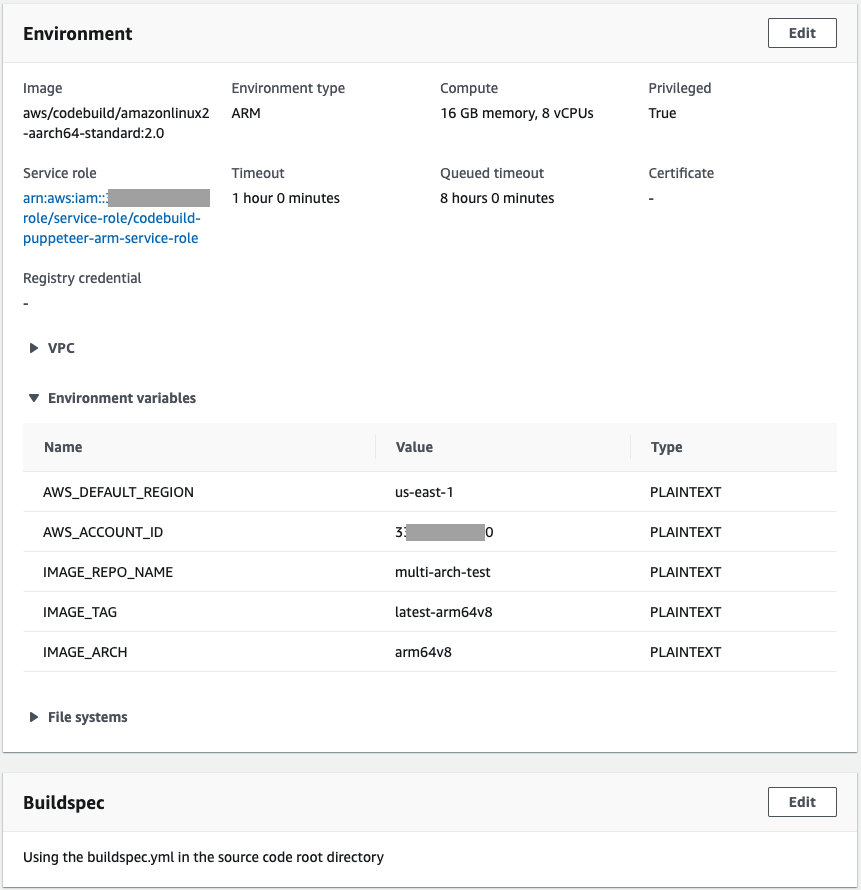
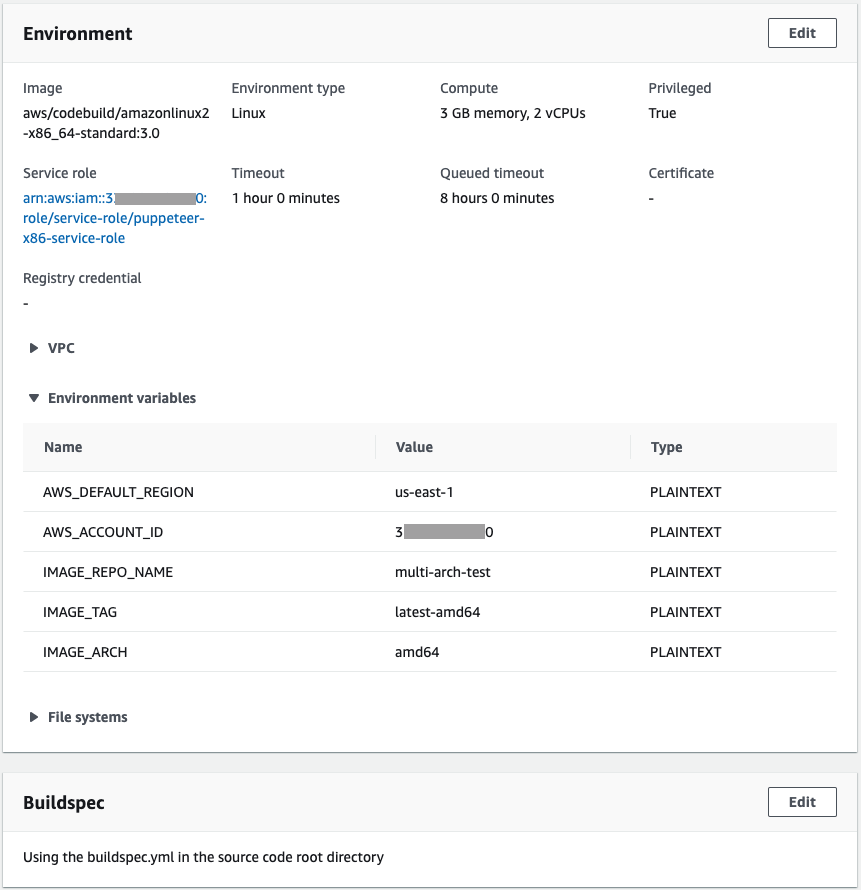
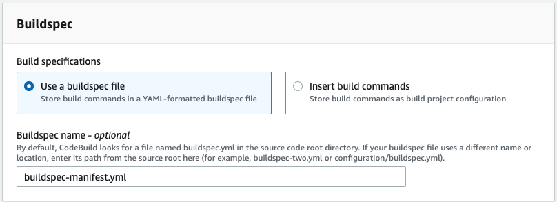
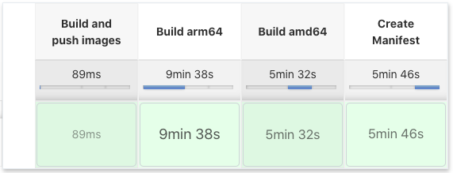

# Creating multi-arch headless browsing (Puppeteer) Docker image
For building the multi-arch images, we are going to produce native build docker images using AWS CodeBuild, publish them to ECR, and then tie them together with a docker image manifest.

I referenced the following documentation to complete the solution:
https://docs.aws.amazon.com/codebuild/latest/userguide/sample-docker.html
https://docs.aws.amazon.com/AmazonECR/latest/userguide/docker-push-multi-architecture-image.html

## CodeBuild Projects
Let's start with creating two CodeBuild projects, one for building amd64 and one for arm64 Docker images (we will create a third for Docker manifest creation later). The projects should be boilerplate, reading source from your SCM or getting it via the CodeBuild Jenkins Plugin. Each should be configured to run the standard image of your choice and on the proper architecture (amd64 or arm64), I chose Amazon Linux 2.

Important things to note: 

1. Use Amazon Linux 2 (not Ubuntu)
2. Mark the project as "Privileged"
3. Configure the project to use the buildspec.yml from source.
4. Since I am using the same `buildspec.yml` file for both CodeBuild projects, we are going to use environment variables on the CodeBuild projects to handle image tagging.
5. Make sure to specify the following environment variables:

Environment Variable | arm64 Project | amd64 Project | manifest Project
---------------------|---------------|---------------|---------
AWS_DEFAULT_REGION |  us-east-1	 | us-east-1 | us-east-1	
AWS_ACCOUNT_ID | 33nnnnnn33 | 33nnnnnn33 | 33nnnnnn33 
IMAGE_REPO_NAME | multi-arch-test | multi-arch-test | multi-arch-test
IMAGE_TAG | **latest-arm64v8** | **latest-amd64** 
IMAGE_ARCH | **arm64v8** | **amd64** | 

### Building native Docker images with a shared buildspec.yml
The CodeBuild projects for creating the Docker images will share the [buildspec.yml](buildspec.yml) file. The buildspec.yml file uses environment variables defined in CodeBuild for building, tagging, and pushing the docker images.

_It is important to note that the IMAGE_TAG and IMAGE_ARCH be properly defined as to be recognized in the buildspec-manifest.yml file (detailed later)._

Each project will be executed independently to produce a platform native image, and push that image to ECR. In the next section we will tie them together with a Docker manifest.

`- docker build -t $IMAGE_REPO_NAME:$IMAGE_TAG --build-arg ARCH=$IMAGE_ARCH/ .`
`- docker tag $IMAGE_REPO_NAME:$IMAGE_TAG $AWS_ACCOUNT_ID.dkr.ecr.$AWS_DEFAULT_REGION.amazonaws.com/$IMAGE_REPO_NAME:$IMAGE_TAG`
`- docker push $AWS_ACCOUNT_ID.dkr.ecr.$AWS_DEFAULT_REGION.amazonaws.com/$IMAGE_REPO_NAME:$IMAGE_TAG`

### Creating a Docker manifest to reference native architecture images
Create a CodeBuild project that reads from the same source repo. Make sure to specify the name of the manifest buildspec file, I chose [buildspec-manifest.yml](buildspec-manifest.yml). 

This project will will create a Docker manifest pointing to the amd64 and arm64 images created & pushed by the previous projects, annotate the manifest with the proper architectures, and then push the manifest to ECR. Let's talk through it:

Create the manifest, and during that creation reference the two native images that were built and pushed previously. We do not yet push the manifest to ECR. I also did not specify a tag for this manifest, so `latest` is assumed. 
_Note that I hardcoded the previous image tags here, but you can easily use environment variables._
`- docker manifest create $AWS_ACCOUNT_ID.dkr.ecr.$AWS_DEFAULT_REGION.amazonaws.com/$IMAGE_REPO_NAME $AWS_ACCOUNT_ID.dkr.ecr.$AWS_DEFAULT_REGION.amazonaws.com/$IMAGE_REPO_NAME:latest-arm64v8 $AWS_ACCOUNT_ID.dkr.ecr.$AWS_DEFAULT_REGION.amazonaws.com/$IMAGE_REPO_NAME:latest-amd64`

Now, we annotate the newly created manifest to specify the platform architecture, and we again reference the two native images that were built and pushed previously. 
_Note that I hardcoded the previous image tags here, but you can easily use environment variables._
`- docker manifest annotate --arch arm64 $AWS_ACCOUNT_ID.dkr.ecr.$AWS_DEFAULT_REGION.amazonaws.com/$IMAGE_REPO_NAME $AWS_ACCOUNT_ID.dkr.ecr.$AWS_DEFAULT_REGION.amazonaws.com/$IMAGE_REPO_NAME:latest-arm64v8`
`- docker manifest annotate --arch amd64 $AWS_ACCOUNT_ID.dkr.ecr.$AWS_DEFAULT_REGION.amazonaws.com/$IMAGE_REPO_NAME $AWS_ACCOUNT_ID.dkr.ecr.$AWS_DEFAULT_REGION.amazonaws.com/$IMAGE_REPO_NAME:latest-amd64`

Last, we push this manifest to ECR.
`- docker manifest push $AWS_ACCOUNT_ID.dkr.ecr.$AWS_DEFAULT_REGION.amazonaws.com/$IMAGE_REPO_NAME`

## Using Jenkins to orchestrate
We will use a Jenkins pipeline to orchestrate the building of the native images and the creation of the manifest. We will use the [Jenkins plugin for Code Build](https://docs.aws.amazon.com/codebuild/latest/userguide/jenkins-plugin.html) to initiate the builds.

The Jenkins Pipeline project will initiate two other Jenkins projects in parallel (using stages) to create the native docker images, and then create the manifest. The project hierarchy looks like this:
- Multi-Arch Pipeline 
  * Stages
    * In Parallel   
      * Build arm64
      * Build amd64
    * Create Manifest

See the [jenkinsfile](jenkinsfile) to see the details of the Pipeline

### Individual Jenkins projects 
The individual Jenkins projects initiate their respective CodeBuild projects with default settings and only specifying the CodeBuild project name. The CodeBuild project will use the buildspec.yml and buildspec-manifest.yml specified earlier for operational control. 

